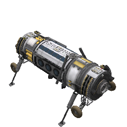
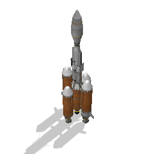
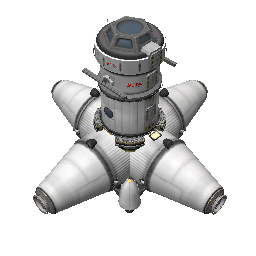

# KSP-Craft

Craft files from Kerbal Space Program

## Version
KSP 1.0.4

## Required Mods
See this repo for modules: <https://github.com/lazarus1331/KSP-GameData.git>

### CKANfigs
Check the CKANfigs directory for exported CKAN configurations that should allow easy installation of required modules.

## Ship descriptions

### Tech level 1-4
- ML1+L1 : Mun Lander v1 with Launch vehicle 1. Designed to take one kerbal to the mun and back, with some science instruments aboard.
- O-X1 : Early LKO capable craft. Seats one kerbal.
- RX-1 : Very similar to O-X1, it is capable of LKO with a bit more fuel for maneuvering. It seats two kerbals.
- Tour-O2 : For cashing in on all those tour contracts for big $$$! Seats three kerbals for a ride into LKO.
- Tour-X2 : Early tour ship, which is capable of escaping the atmosphere with three kerbals aboard.

### Tech level 1-10
- Ships/SPH/SciRover3 : Final rendition of the Science Lab Rover line, with all scientific sensors. 
- Ships/SPH/Mining Base1 : Mining and ISRU Rover, with Fuel storage tanks. 
- Ships/VAB/BaySat5L+DV+LTV1 : Science Probe; Lander configuration with interplanetary transfer and launch vehicles. 
- Ships/VAB/MFerry2+L2 : Kerbal (x7) Ferry and return vehicle, with refueling module and launch vehicle. 
- Ships/VAB/RefuelDepot1 : Refuel depot. 

### Tech level 1-15

## Makefile

`make syncto` -- will sync to a save folder

`make syncfrom` -- will sync from a save folder

As a helper to copy back and forth the ships to my current save I added a Makefile, you can simply type `make` in the current directory to see it’s help, when setting the path make it absolute
and escape your spaces, e.g.:
```
/mnt/xyliss/SteamLibrary/SteamApps/common/Kerbal\ Space\ Program/saves/Nasa
```
once you enter it, it is saved by the Makefile for future runs as savepath in the current directory, to change it, simply remove the file
